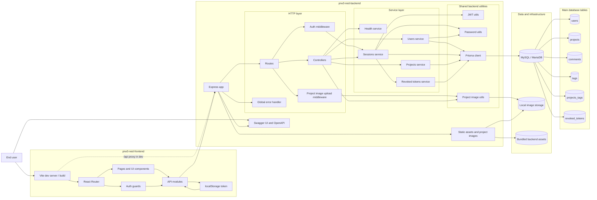

# Project DemoDeck Architecture Diagram

```mermaid
flowchart LR
    User[End user]

    subgraph Frontend[prw3-ned-frontend]
        Vite[Vite dev server / build]
        Router[React Router]
        Pages[Pages and UI components]
        Guards[Auth guards]
        ApiClient[API modules]
        TokenStore[localStorage token]
    end

    subgraph Backend[prw3-ned-backend]
        ExpressApp[Express app]
        StaticFiles[Static assets and project images]
        Swagger[Swagger UI and OpenAPI]

        subgraph HttpLayer[HTTP layer]
            Routes[Routes]
            AuthMw[Auth middleware]
            UploadMw[Project image upload middleware]
            Controllers[Controllers]
            ErrorHandler[Global error handler]
        end

        subgraph DomainLayer[Service layer]
            HealthService[Health service]
            UsersService[Users service]
            SessionsService[Sessions service]
            ProjectsService[Projects service]
            RevokedTokensService[Revoked tokens service]
        end

        subgraph BackendUtils[Shared backend utilities]
            JwtUtils[JWT utils]
            PasswordUtils[Password utils]
            ProjectImageUtils[Project image utils]
            PrismaClient[Prisma client]
        end
    end

    subgraph DataInfra[Data and infrastructure]
        DB[(MySQL / MariaDB)]
        Storage[(Local image storage)]
        Assets[(Bundled backend assets)]
    end

    subgraph Tables[Main database tables]
        Users[(users)]
        Projects[(projects)]
        Comments[(comments)]
        Tags[(tags)]
        ProjectTags[(projects_tags)]
        Revoked[(revoked_tokens)]
    end

    User --> Vite
    Vite --> Router
    Router --> Guards
    Router --> Pages
    Pages --> ApiClient
    Guards --> ApiClient
    ApiClient --> TokenStore
    TokenStore --> ApiClient

    Vite -. /api proxy in dev .-> ExpressApp
    ApiClient --> ExpressApp
    User --> Swagger

    ExpressApp --> StaticFiles
    ExpressApp --> Swagger
    ExpressApp --> Routes
    ExpressApp --> ErrorHandler

    Routes --> AuthMw
    Routes --> UploadMw
    Routes --> Controllers
    AuthMw --> SessionsService
    UploadMw --> ProjectImageUtils
    Controllers --> HealthService
    Controllers --> UsersService
    Controllers --> SessionsService
    Controllers --> ProjectsService
    Controllers --> ProjectImageUtils

    SessionsService --> JwtUtils
    SessionsService --> PasswordUtils
    SessionsService --> RevokedTokensService
    UsersService --> PasswordUtils

    UsersService --> PrismaClient
    SessionsService --> PrismaClient
    ProjectsService --> PrismaClient
    RevokedTokensService --> PrismaClient

    PrismaClient --> DB
    ProjectImageUtils --> Storage
    StaticFiles --> Storage
    StaticFiles --> Assets

    DB --> Users
    DB --> Projects
    DB --> Comments
    DB --> Tags
    DB --> ProjectTags
    DB --> Revoked
```
