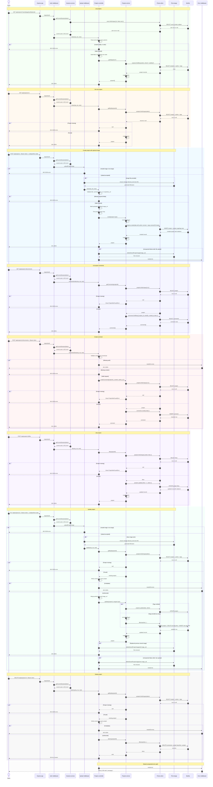

# Projects DemoDeck Sequence Diagram

```mermaid
sequenceDiagram
    autonumber

    actor Client
    participant App as Express app
    participant Auth as Auth middleware
    participant Sessions as Sessions service
    participant Upload as Upload middleware
    participant Controller as Projects controller
    participant Service as Projects service
    participant Prisma as Prisma client
    participant FS as File storage
    participant DB as MySQL
    participant Error as Error middleware

    rect rgb(245, 255, 245)
        Note over Client,DB: List projects
        Client->>App: GET /api/projects?name&tags&sortBy&order
        App->>Auth: requireAuth
        Auth->>Sessions: getCurrentSession(token)
        Sessions->>Prisma: users.findUnique({ id: token.sub })
        Prisma->>DB: SELECT user by token subject
        DB-->>Prisma: user row or null
        Prisma-->>Sessions: user row or null
        Sessions-->>Auth: current user or 401 error
        Auth->>Controller: index(req, res, next)
        Controller->>Controller: Parse and validate query params
        alt Invalid sortBy or order
            Controller-->>Client: 400 JSON error
        else Valid request
            Controller->>Controller: Build filters and default sort order
            Controller->>Service: getAll(options?)
            Service->>Prisma: projects.findMany(select, where?, orderBy?)
            Prisma->>DB: SELECT projects + author + tags
            DB-->>Prisma: rows
            Prisma-->>Service: project records
            Service->>Service: mapProject()
            Service-->>Controller: projects[]
            Controller-->>Client: 200 JSON
        end
    end

    rect rgb(255, 249, 240)
        Note over Client,DB: Get one project
        Client->>App: GET /api/projects/:id
        App->>Auth: requireAuth
        Auth->>Sessions: getCurrentSession(token)
        Sessions-->>Auth: current user or 401 error
        Auth->>Controller: show(req, res, next)
        Controller->>Service: getById(projectId)
        Service->>Prisma: projects.findUnique(select)
        Prisma->>DB: SELECT project + author + tags
        DB-->>Prisma: row or null
        Prisma-->>Service: record or null
        alt Project missing
            Service-->>Controller: null
            Controller-->>Client: 404 JSON error
        else Found
            Service->>Service: mapProject()
            Service-->>Controller: project
            Controller-->>Client: 200 JSON
        end
    end

    rect rgb(240, 250, 255)
        Note over Client,FS: Create project with optional image
        Client->>App: POST /api/projects + Bearer token + multipart/form-data
        App->>Auth: requireAuth
        Auth->>Sessions: getCurrentSession(token)
        Sessions-->>Auth: current user or 401 error
        Auth->>Upload: uploadProjectImage
        alt Invalid image or too large
            Upload-->>Client: 400 JSON error
        else Upload accepted
            opt Image file provided
                Upload->>FS: ensure storage directory and store file
                FS-->>Upload: generated filename
            end
            Upload->>Controller: store(req, res, next)
            Controller->>Controller: Validate title, summary, demo_url, repository_url
            alt Missing required fields
                Controller-->>Client: 400 JSON error
            else Valid request
                Controller->>Controller: Build uploaded or default image_url
                Controller->>Controller: Trim provided tags array
                Controller->>Service: create(project input)
                Service->>Service: normalizeTags()
                Service->>Prisma: projects.create(data with author connect + tags connectOrCreate)
                Prisma->>DB: INSERT project + project_tags/tag rows
                DB-->>Prisma: created project with relations
                Prisma-->>Service: created record
                Service->>Service: mapProject()
                Service-->>Controller: project
                Controller-->>Client: 201 JSON
            end
            opt Unexpected failure after file upload
                Controller->>FS: deleteStoredProjectImage(image_url)
                FS-->>Controller: file removed
                Controller->>Error: next(error)
            end
        end
    end

    rect rgb(245, 245, 255)
        Note over Client,DB: List project comments
        Client->>App: GET /api/projects/:id/comments
        App->>Auth: requireAuth
        Auth->>Sessions: getCurrentSession(token)
        Sessions-->>Auth: current user or 401 error
        Auth->>Controller: commentsIndex(req, res, next)
        Controller->>Service: getComments(projectId)
        Service->>Prisma: projects.findUnique({ id })
        Prisma->>DB: SELECT project
        DB-->>Prisma: row or null
        alt Project missing
            Prisma-->>Service: null
            Service-->>Controller: throw ProjectNotFoundError
            Controller-->>Client: 404 JSON error
        else Found
            Prisma-->>Service: project
            Service->>Prisma: comments.findMany({ project_id, orderBy: created_at desc })
            Prisma->>DB: SELECT comments
            DB-->>Prisma: comment rows
            Prisma-->>Service: comments[]
            Service-->>Controller: comments[]
            Controller-->>Client: 200 JSON
        end
    end

    rect rgb(255, 245, 245)
        Note over Client,DB: Create comment
        Client->>App: POST /api/projects/:id/comments + Bearer token
        App->>Auth: requireAuth
        Auth->>Sessions: getCurrentSession(token)
        Sessions-->>Auth: current user or 401 error
        Auth->>Controller: commentsStore(req, res, next)
        Controller->>Controller: Validate content and currentUser
        alt Missing auth
            Controller->>Error: next(401 error)
            Error-->>Client: 401 JSON
        else Missing content
            Controller-->>Client: 400 JSON error
        else Valid request
            Controller->>Service: createComment(projectId, { content, author_id })
            Service->>Prisma: projects.findUnique({ id })
            Prisma->>DB: SELECT project
            DB-->>Prisma: row or null
            alt Project missing
                Prisma-->>Service: null
                Service-->>Controller: throw ProjectNotFoundError
                Controller-->>Client: 404 JSON error
            else Found
                Prisma-->>Service: project
                Service->>Prisma: comments.create({ data })
                Prisma->>DB: INSERT comment
                DB-->>Prisma: inserted row
                Prisma-->>Service: comment
                Service-->>Controller: comment
                Controller-->>Client: 201 JSON
            end
        end
    end

    rect rgb(250, 245, 255)
        Note over Client,DB: Like project
        Client->>App: POST /api/projects/:id/like
        App->>Auth: requireAuth
        Auth->>Sessions: getCurrentSession(token)
        Sessions-->>Auth: current user or 401 error
        Auth->>Controller: like(req, res, next)
        Controller->>Service: like(projectId)
        Service->>Prisma: projects.findUnique({ select: likes })
        Prisma->>DB: SELECT likes
        DB-->>Prisma: row or null
        alt Project missing
            Prisma-->>Service: null
            Service-->>Controller: throw ProjectNotFoundError
            Controller-->>Client: 404 JSON error
        else Found
            Prisma-->>Service: likes
            Service->>Prisma: projects.update({ likes + 1, select })
            Prisma->>DB: UPDATE project likes
            DB-->>Prisma: updated row with relations
            Prisma-->>Service: updated record
            Service->>Service: mapProject()
            Service-->>Controller: project
            Controller-->>Client: 200 JSON
        end
    end

    rect rgb(245, 255, 250)
        Note over Client,FS: Update project
        Client->>App: PUT /api/projects/:id + Bearer token + multipart/form-data
        App->>Auth: requireAuth
        Auth->>Sessions: getCurrentSession(token)
        Sessions-->>Auth: current user or 401 error
        Auth->>Upload: uploadProjectImage
        alt Invalid image or too large
            Upload-->>Client: 400 JSON error
        else Upload accepted
            opt New image sent
                Upload->>FS: ensure storage directory and store file
                FS-->>Upload: generated filename
            end
            Upload->>Controller: update(req, res, next)
            Controller->>Service: getById(projectId)
            Service->>Prisma: projects.findUnique(select)
            Prisma->>DB: SELECT project + author + tags
            DB-->>Prisma: row or null
            alt Project missing
                Service-->>Controller: null
                Controller-->>Client: 404 JSON error
            else Found
                Service-->>Controller: existing project
                Controller->>Controller: Verify current user owns project
                alt Forbidden
                    Controller->>Error: next(403 error)
                    Error-->>Client: 403 JSON
                else Authorized
                    Controller->>Controller: Merge partial body and image_url
                    Controller->>Service: update(projectId, merged input)
                    alt Tags omitted
                        Service->>Prisma: projects.update(data, select)
                        Prisma->>DB: UPDATE project
                    else Tags provided as array
                        Service->>Service: normalizeTags()
                        Service->>Prisma: $transaction(...)
                        Prisma->>DB: UPDATE project + DELETE old tag links + INSERT new tag links
                    end
                    DB-->>Prisma: updated row
                    Prisma-->>Service: updated record
                    Service->>Service: mapProject()
                    Service-->>Controller: project
                    opt Replaced previous stored image
                        Controller->>FS: deleteStoredProjectImage(old image_url)
                        FS-->>Controller: file removed
                    end
                    Controller-->>Client: 200 JSON
                end
            end
            opt Unexpected failure after new upload
                Controller->>FS: deleteStoredProjectImage(new image_url)
                FS-->>Controller: file removed
                Controller->>Error: next(error)
            end
        end
    end

    rect rgb(248, 248, 248)
        Note over Client,DB: Delete project
        Client->>App: DELETE /api/projects/:id + Bearer token
        App->>Auth: requireAuth
        Auth->>Sessions: getCurrentSession(token)
        Sessions-->>Auth: current user or 401 error
        Auth->>Controller: destroy(req, res, next)
        Controller->>Service: getById(projectId)
        Service->>Prisma: projects.findUnique(select)
        Prisma->>DB: SELECT project + author + tags
        DB-->>Prisma: row or null
        alt Project missing
            Service-->>Controller: null
            Controller-->>Client: 404 JSON error
        else Found
            Service-->>Controller: existing project
            Controller->>Controller: Verify current user owns project
                alt Forbidden
                    Controller->>Error: next(403 error)
                    Error-->>Client: 403 JSON
                else Authorized
                    Controller->>Service: destroy(projectId)
                    Service->>Prisma: $transaction(...)
                    Prisma->>DB: DELETE comments + project tag links + project
                    DB-->>Prisma: success
                    Prisma-->>Service: done
                    Service-->>Controller: void
                    Controller-->>Client: 204 No Content
                end
        end
    end

    rect rgb(252, 252, 252)
        Note over Controller,Error: Shared unexpected error path
        Controller->>Error: next(error)
        Error-->>Client: status || 500 with { message }
    end
```
